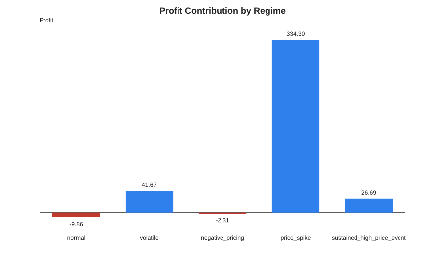
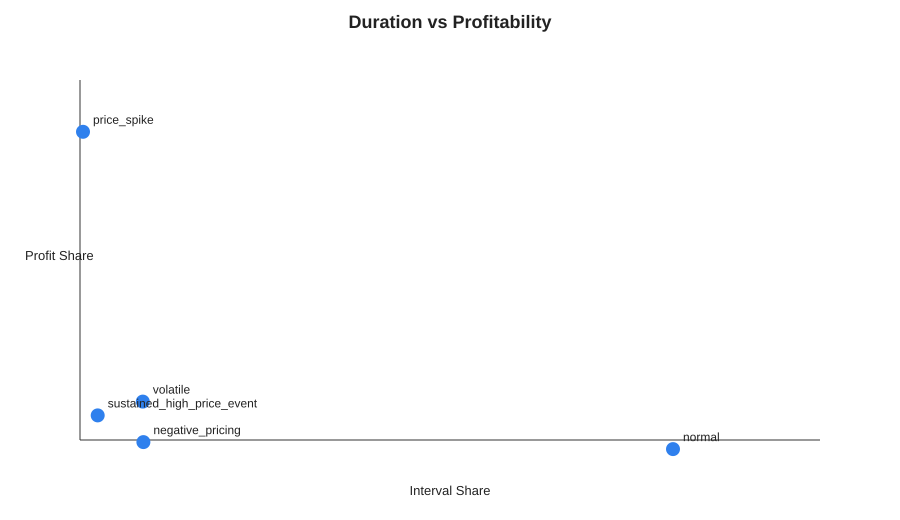
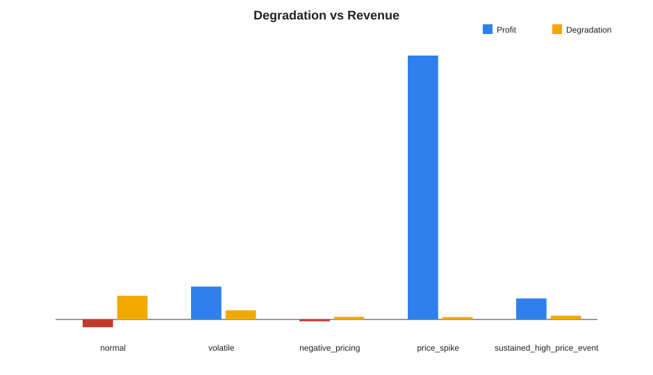

# Regime Profitability Study

## Inputs

- Prices: `/Users/danielchoi/Coding/energyArbitrage/energy_arbitrage/data/qld_prices_6m.csv`
- Backtest: `/Users/danielchoi/Coding/energyArbitrage/energy_arbitrage/outputs/backtest_results.csv`
- Alignment: Backtest rows were aligned to historical market prices by standardised timestamp. Matched 44063 of 44063 rows (100.00%). Regime attribution used aligned market prices only.

## Key Findings

- price_spike contributed the largest absolute P&L: 334.30 (85.6% of total profit).
- Price spikes represented 0.4% of intervals and contributed 85.6% of total profitability.
- In normal periods, degradation outweighed realised value.
- Volatility-linked regimes contributed 103.1% of total profitability.

## Regime Summary

| Regime | Interval Share | Total Profit | Profit Share | Energy Exported | Cycles | Degradation |
| --- | ---: | ---: | ---: | ---: | ---: | ---: |
| `normal` | 80.14% | -9.8623 | -2.53% | 179.3100 | 44.4719 | 30.0185 |
| `volatile` | 8.48% | 41.6682 | 10.67% | 193.5230 | 17.2540 | 11.6464 |
| `negative_pricing` | 8.57% | -2.3080 | -0.59% | 0.0000 | 4.9296 | 3.3275 |
| `price_spike` | 0.41% | 334.3031 | 85.61% | 59.9520 | 4.4409 | 2.9976 |
| `sustained_high_price_event` | 2.39% | 26.6879 | 6.83% | 94.9830 | 7.0358 | 4.7492 |

## Charts








## Reproducibility

Run from the repository root:

```bash
python3 research/run_regime_study.py
```

This study is attribution-only and does not change dispatch decisions.