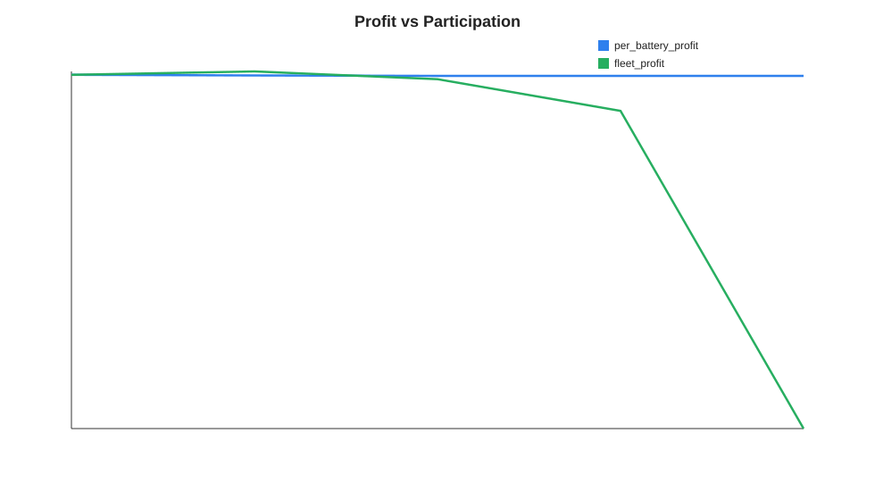
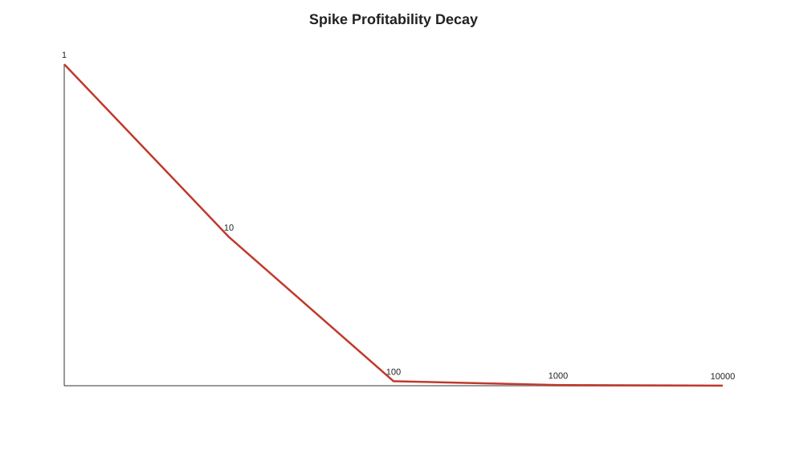
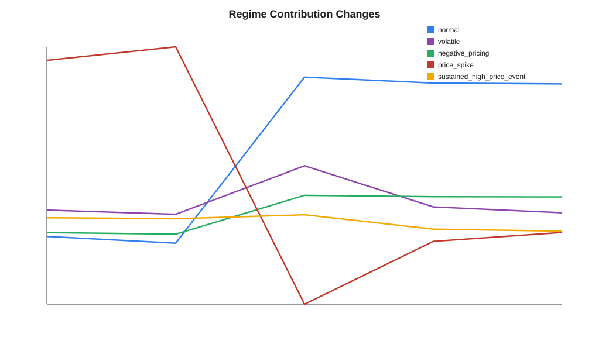
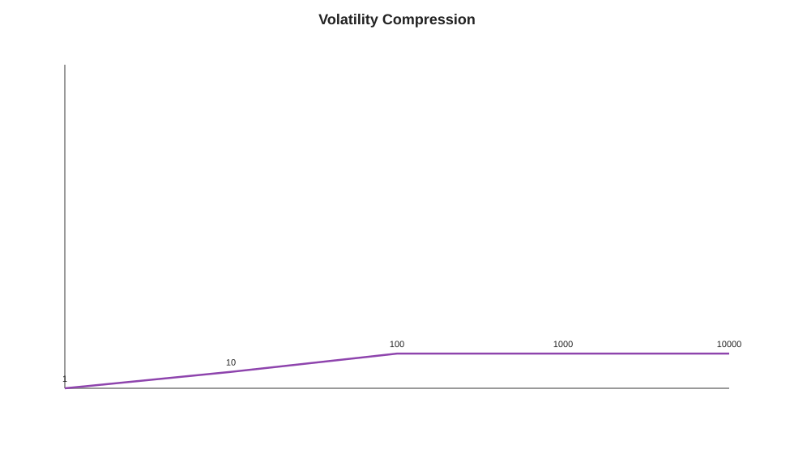

# Saturation Study

## Inputs

- Regime classifications: `/Users/danielchoi/Coding/energyArbitrage/energy_arbitrage/research/output/regime_classifications.csv`
- Participation levels: `1, 10, 100, 1000, 10000`

## Assumptions

- Battery size: `13.5`
- Reaction aggressiveness: `1.0`
- Spread compression factor: `0.05`
- Export-window competition factor: `0.02`
- Degradation cost per energy: `0.05`

## Key Findings

- Per-battery profitability materially collapses by 10 batteries (57.1% decay).
- Spike profitability changes from 334.30 to 0.07 by 10000 batteries (100.0% decay).
- At the highest participation level, degradation dominates: normal, volatile, negative_pricing, sustained_high_price_event
- Residential systems are most exposed to per-battery revenue compression in shared spike windows; grid-scale systems may preserve fleet revenue longer but still face spread compression and degradation drag.

## Profit Decay Curve

| Batteries | Per-Battery Profit | Fleet Profit | Profit Decay | Volatility Compression | Degradation |
| ---: | ---: | ---: | ---: | ---: | ---: |
| 1 | 390.4889 | 390.4889 | 0.00% | 0.00% | 52.7393 |
| 10 | 167.4727 | 1674.7272 | 57.11% | 5.08% | 49.7810 |
| 100 | -12.7779 | -1277.7862 | 103.27% | 10.72% | 39.8538 |
| 1000 | -13.2873 | -13287.3084 | 103.40% | 10.72% | 34.2704 |
| 10000 | -13.3628 | -133628.4570 | 103.42% | 10.72% | 33.4425 |

## Historical Regime Frequencies

| Regime | Interval Share | Interval Count |
| --- | ---: | ---: |
| `normal` | 80.14% | 35312 |
| `volatile` | 8.48% | 3738 |
| `negative_pricing` | 8.57% | 3777 |
| `price_spike` | 0.41% | 181 |
| `sustained_high_price_event` | 2.39% | 1055 |

## Charts









## Reproducibility

```bash
python3 research/run_saturation_study.py
```

This study is analytical only. It does not change strategy logic or dispatch decisions.